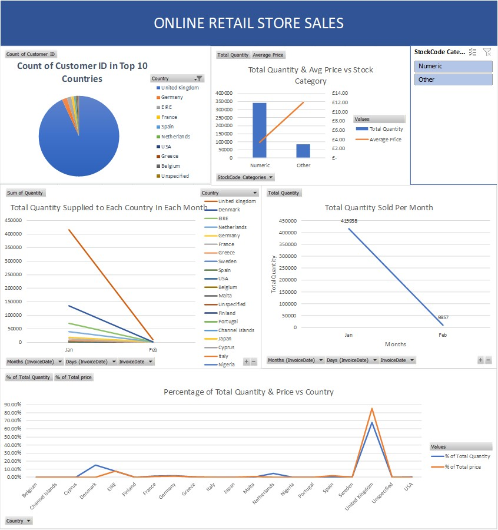

# Online Retail Store Sales Dashboard

## Overview
This project is an *Excel-based* retail store sales analysis along with dashboard.  
The goal of the project was to practice data cleaning, pivot table creation and dashboard creation using Microsoft Excel.

The result is an **interactive dashboard** that provides insights into sales quantity, pricing, customer distribution and trends over time.

---

## Dataset
Source: Online Retail II UCI 

Link: https://www.kaggle.com/datasets/mashlyn/online-retail-ii-uci/data

The dataset was reduced in size to include data for 2 months (01-01-2010 to 01-02-2010). This was done to make handling data in Excel more manageable.

- The Dataset includes following information:
  - Invoice 
  - Stock code
  - Description
  - Quantity
  - Invoice Date
  - Price
  - Customer ID
  - Country
  

---

## Data Preparation 
Basic data cleaning was performed directly in Excel to make it fit for analysis including:
- Filtering the dataset to a specific date range (01-01-2010 to 01-02-2010)
- Converting text-formatted numbers to numerical values
- Removing duplicate records
- Handling missing values (converted to 'Unknown')
- Cleaning invalid or test product decription entries 
- Cleaning negative quantities 
- Categorizing stock codes for better analysis

---

## Analysis & Pivot Tables
An analysis was done using Excel pivot tables, including:
- CustomerID Count by Country
- Percentage contribution of Quantity and Revenue by Country
- Total Quantity and Average Price vs StockCode Category
- Monthly total sales quantity trend
- Total Quantity by each Country in each Month

Slicers were used to enable interactive filtering of last 3 tables by StockCode Category.

---

## Dashboard
The Excel dashboard provides detailed insights using:
- Pivot charts
- Slicers for interactivity
- Analysis of quantity-based and price-based values

A preview of the dashboard is shown below:

---

## Tools Used
- Microsoft Excel
  - Filters
  - Formulas
  - Pivot Tables
  - Charts
  - Slicers

**Note**: This project focuses solely on Excel-based analysis and visualization.  
No other tools such as SQL, Python, Tableau or Power BI were used.

---

## Project Structure
- Raw Data: RawretailstoresalesData.csv
- Cleaned Data: RetailStoreSalesCleaned.csv
- Pivot Tables: RetailStoreSalesPivotTables.csv
- Dashboard in Excel: RetailStoreSalesDashboard.xlsx
- Dashboard Image: RetailStoreSalesDashboardImage.jpg

**Note**: Files were committed as .csv files due to GitHub file size limitations.

